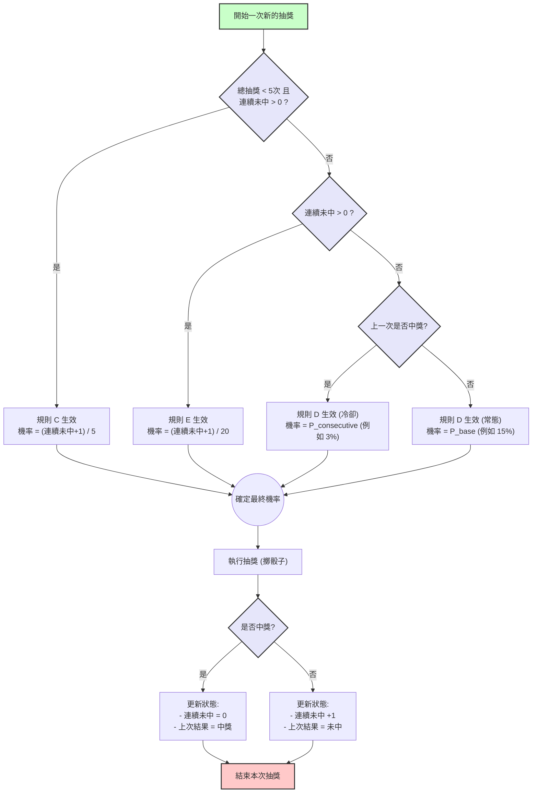

"# draw" 

```mermaid
graph TD
    A["開始一次新的抽獎"] --> B{"總抽獎 < 5次 且<br>連續未中 > 0 ?"};
    
    B -- 是 --> C["規則 C 生效<br>機率 = (連續未中+1) / 5"];
    
    B -- 否 --> D{"連續未中 > 0 ?"};
    
    D -- 是 --> E["規則 E 生效<br>機率 = (連續未中+1) / 20"];
    
    D -- 否 --> F{"上一次是否中獎?"};
    
    F -- 是 --> G["規則 D 生效 (冷卻)<br>機率 = P_consecutive (例如 3%)"];
    
    F -- 否 --> H["規則 D 生效 (常態)<br>機率 = P_base (例如 15%)"];
    
    C --> I(("確定最終機率"));
    E --> I;
    G --> I;
    H --> I;
    
    I --> J["執行抽獎 (擲骰子)"];
    
    J --> K{"是否中獎?"};
    
    K -- 是 --> L["更新狀態:<br>- 連續未中 = 0<br>- 上次結果 = 中獎"];
    
    K -- 否 --> M["更新狀態:<br>- 連續未中 +1<br>- 上次結果 = 未中"];
    
    L --> N["結束本次抽獎"];
    M --> N;

    style A fill:#c9ffc9,stroke:#333,stroke-width:2px
    style N fill:#ffc9c9,stroke:#333,stroke-width:2px
    style B fill:#e6e6fa,stroke:#333,stroke-width:2px
    style D fill:#e6e6fa,stroke:#333,stroke-width:2px
    style F fill:#e6e6fa,stroke:#333,stroke-width:2px
    style K fill:#e6e6fa,stroke:#333,stroke-width:2px
```
